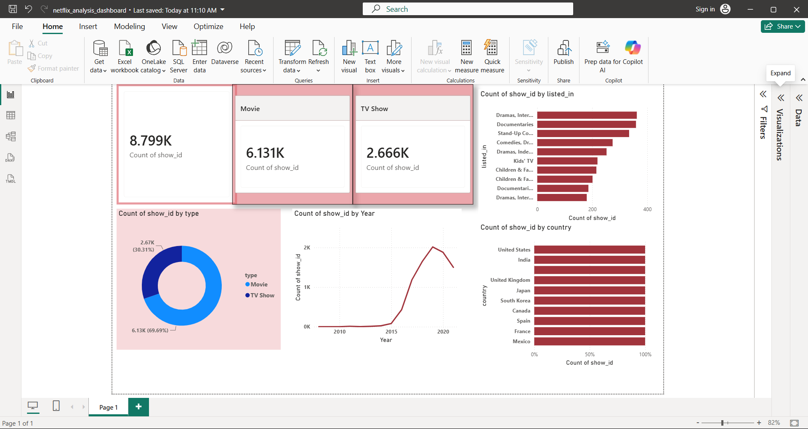

# 🎬 Netflix Content Analysis

## 📖 Project Overview
This is an end-to-end data analytics project analyzing Netflix's content catalog. The dataset includes 8,807 movies and TV shows with information on genre, country, release year, and more. The goal was to uncover patterns in Netflix's content strategy and present actionable insights.

## 🎯 Business Questions Answered
1. What is the distribution of Movies vs TV Shows?
2. What are the most popular genres on Netflix?
3. Which countries produce the most content?
4. How has Netflix's content library grown over time?
5. What are the most common age certifications?

## 🔍 Key Insights
| Metric | Finding |
|--------|---------|
| **Total Titles** | 8,807 |
| **Movies** | 6,131 (69.6%) |
| **TV Shows** | 2,676 (30.4%) |
| **Top Genre** | International Movies (2,624 titles) |
| **Top Country** | United States |
| **Most Common Rating** | TV-MA |

## 💡 Core Takeaways
- **Movies dominate Netflix's catalog** at nearly 70% of all content.
- **International content is a major focus** — International Movies is the #1 genre.
- **US and India** are the top content-producing countries.
- **TV-MA** is the most common rating, indicating a focus on adult content.

## 🛠️ Tools Used
- **Excel:** Initial data exploration and cleaning
- **SQL (PostgreSQL, DBeaver):** Data extraction, cleaning, and aggregation
- **Python (Pandas, Matplotlib):** Data validation and visualization
- **Power BI:** Interactive dashboard creation

## 📂 Project Structure
- [Power BI Dashboard](Netflix_Analysis_Dashboard.pbix)
- [Python Notebook](netflix_analysis.ipynb)
- [Raw Data](netflix_titles.csv)

## 📊 Dashboard Preview

## 🚀 How to Run This Project
1. Clone the repository
2. Open `powerbi/netflix_dashboard.pbix` in Power BI Desktop
3. Explore the interactive dashboard

## 📝 Future Improvements
- Add IMDB ratings for deeper analysis
- Build a recommendation system using Python
- Analyze content by director and cast
